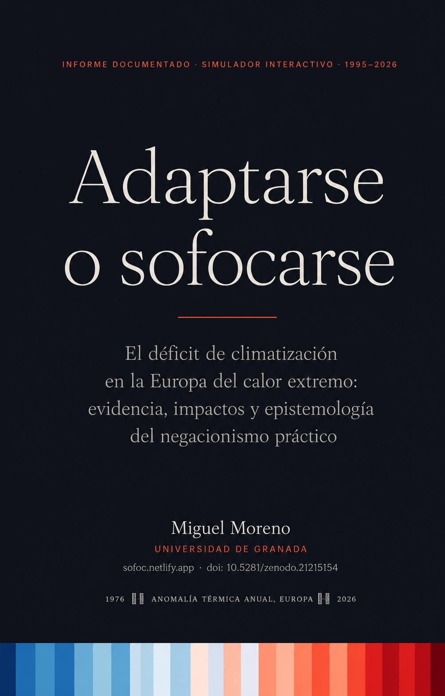

<p align="center">
  
</p>

<h1 align="center">Adaptarse o sofocarse</h1>
<p align="center">
  <em>El déficit de climatización en la Europa del calor extremo:<br>
  evidencia, impactos y epistemología del negacionismo práctico (1995–2026)</em>
</p>

<p align="center">
  <a href="https://doi.org/10.5281/zenodo.21215154"></a>
  <a href="https://sofoc.netlify.app"></a>
  <a href="https://utilizas.github.io/sofoc/"></a>
  <a href="https://sofoc.vercel.app/"></a>
  <a href="https://sofoc.utilizas.workers.dev/"></a>
  <br>
  
  <a href="https://creativecommons.org/licenses/by/4.0/"></a>
</p>

---

## Resumen

Informe académico documentado (~60 referencias APA 7 con notas al pie) sobre el déficit estructural de climatización en la Europa central y del sur, contrastado con dos décadas de olas de calor recurrentes (1995–2026). Incluye un **simulador térmico interactivo** (JavaScript vanilla, modelo RC) y desarrolla una taxonomía original del negacionismo climático — **teórico, práctico y performativo** — aplicada al retraso normativo en la adaptación del parque edificado.

Documento Quarto autocontenido (`embed-resources: true`): un único `.qmd` con YAML, CSS y JavaScript integrados.

## Contenido

- La tendencia documentada (1995–2026): del suceso raro al patrón regular
- Salud: quién muere, por qué de noche y dónde
- El parque edificado como amplificador del riesgo
- Impacto económico, laboral, social y psicológico: el confinamiento térmico
- La síntesis técnica: por qué la bomba de calor reversible
- Epistemología del negacionismo: teórico, práctico y performativo

## Acceso al informe

| Punto de acceso | Enlace | Nota |
|---|---|---|
| Demo (canónico) | [sofoc.netlify.app](https://sofoc.netlify.app) | Despliegue de referencia |
| Mirror | [utilizas.github.io/sofoc](https://utilizas.github.io/sofoc/) | GitHub Pages |
| Mirror | [sofoc.vercel.app](https://sofoc.vercel.app/) | Vercel |
| Mirror | [sofoc.utilizas.workers.dev](https://sofoc.utilizas.workers.dev/) | Cloudflare Workers |
| Repositorio | [github.com/utilizas/sofoc](https://github.com/utilizas/sofoc) | Código fuente (`.qmd`) |
| Archivo permanente | [doi.org/10.5281/zenodo.21215154](https://doi.org/10.5281/zenodo.21215154) | Zenodo (versión + concepto DOI) |

## Cómo citar

**Formato APA:**

> Moreno-Muñoz, M. (2026). *Adaptarse o sofocarse. El déficit de climatización en la Europa del calor extremo: evidencia, impactos y epistemología del negacionismo práctico (1995–2026)*. Zenodo. https://doi.org/10.5281/zenodo.21215154

**BibTeX:**

```bibtex
@misc{moreno_munoz_2026_sofocarse,
  author       = {Moreno-Muñoz, Miguel},
  title        = {{Adaptarse o sofocarse. El déficit de climatización en la
                   Europa del calor extremo: evidencia, impactos y
                   epistemología del negacionismo práctico (1995–2026)}},
  year         = {2026},
  publisher    = {Zenodo},
  doi          = {10.5281/zenodo.21215154},
  url          = {https://doi.org/10.5281/zenodo.21215154}
}
```

## Estado y mantenimiento

Versión actual: **v1.0**. Las cifras de 2026 son provisionales a fecha de compilación. Está prevista una revisión **v1.1** en otoño de 2026, cuando se publiquen la estimación consolidada de ISGlobal (*Nature Medicine*), el balance final de Santé publique France y el cierre de la campaña MoMo/ISCIII — conservando el DOI de concepto y generando un nuevo DOI de versión en Zenodo.

## Licencia

Contenido publicado bajo licencia [Creative Commons Atribución 4.0 Internacional (CC BY 4.0)](https://creativecommons.org/licenses/by/4.0/).

## Autor

**Miguel Moreno-Muñoz** — Universidad de Granada
